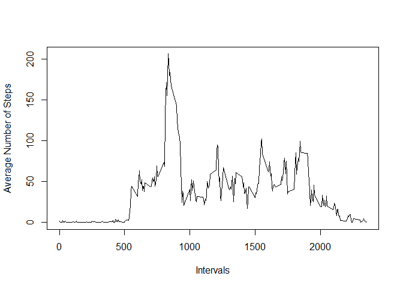
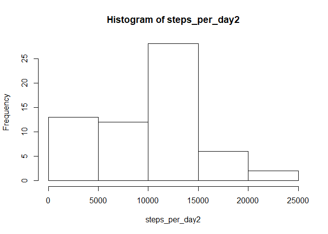
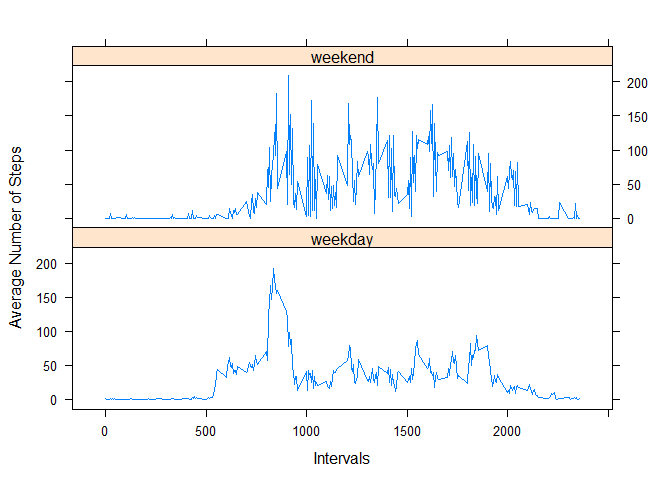

## Loading and preprocessing the data
1. Load the data (i.e. read.csv())

```r
data<- read.csv("./activity.csv", na.strings="NA")
library(ggplot2)
library(lattice)
```
2. Process/transform the data (if necessary) into a format suitable for your analysis

```r
data$steps<- as.numeric(data$steps)
data$date<- as.Date(data$date)
```
## What is mean total number of steps taken per day?
1. Calculate the total number of steps taken per day

```r
steps_per_day<- tapply(data$steps, data$date, sum, na.rm=TRUE)
head(steps_per_day)
```

```
## 2012-10-01 2012-10-02 2012-10-03 2012-10-04 2012-10-05 2012-10-06 
##          0        126      11352      12116      13294      15420
```
2. make histogram of steps taken each day

```r
hist(steps_per_day)
```

<!-- -->

3. Calculate and report mean and median of total number steps per day

```r
mean(steps_per_day)
```

```
## [1] 9354.23
```

```r
median(steps_per_day)
```

```
## [1] 10395
```
## What is the average daily activity pattern?
1. Make a time series plot of the 5-minute interval (x-axis) and the average number of steps taken, averaged across all days (y-axis)

```r
intervalsteps<- tapply(data$steps, data$interval, mean, na.rm=TRUE)
plot(y=intervalsteps, x= names(intervalsteps), type="l", ylab="Average Number of Steps",
xlab="Intervals")
```

<!-- -->

2. Which 5-minute interval, on average across all the days in the dataset, contains the maximum number of steps?

```r
subset(intervalsteps, intervalsteps==max(intervalsteps))
```

```
##      835 
## 206.1698
```
Answer: Interval 835 with 260 steps.

## Imputing missing values
1. Calculate and report the total number of missing values in the dataset (i.e. the total number of rows with NAs)

```r
NAdata<-subset(data, is.na(data$steps))
nrow(NAdata)
```

```
## [1] 2304
```
2. Devise a strategy for filling in all of the missing values in the dataset. 

Strategy: The NA step values will be replaced with zeros (0). 

3. Create a new dataset that is equal to the original dataset but with the missing data filled in.

```r
data2<- data
data2$steps[is.na(data2$steps)]<- 0
head(data2)
```

```
##   steps       date interval
## 1     0 2012-10-01        0
## 2     0 2012-10-01        5
## 3     0 2012-10-01       10
## 4     0 2012-10-01       15
## 5     0 2012-10-01       20
## 6     0 2012-10-01       25
```
4. Make a histogram of the total number of steps taken each day. 

```r
steps_per_day2<- tapply(data2$steps, data2$date, sum, na.rm=TRUE)
hist(steps_per_day2)
```

<!-- -->

Calculate and report the mean and median total number of steps taken per day. 

```r
mean(steps_per_day2)
```

```
## [1] 9354.23
```

```r
median(steps_per_day2)
```

```
## [1] 10395
```
Do these values differ from the estimates from the first part of the assignment? 

Answer: No, they do not differ. 

What is the impact of imputing missing data on the estimates of 
the total daily number of steps?

Answer: Imputing these missing NA values as zeros had no impact on the mean and median values. 

## Are there differences in activity patterns between weekdays and weekends? 
1. Create a new factor variable in the dataset with two levels - "weekday" and "weekend" indicating whether a given date is a weekday or weekend day.

```r
data2$weekend <- ifelse(weekdays(data2$date)== c("Saturday", "Sunday"), "weekend", "weekday")
```
2. Make a panel plot containing a time series plot (i.e. type = "l") of the 5-minute interval (x-axis) and the average number of steps taken, averaged across all weekday days or weekend days (y-axis). 

```r
 intervalsteps2 <- aggregate(data2$steps ~ data2$interval + data2$weekend, data=data2, mean) 
 colnames(intervalsteps2)<- c("interval", "weekend", "steps")
xyplot(intervalsteps2$steps~intervalsteps2$interval|intervalsteps2$weekend, 
 data= intervalsteps2, type="l", layout=c(1,2), ylab="Average Number of Steps",
xlab="Intervals")
```

<!-- -->

Are there differences in activity patterns between weekdays and weekends?

Answer: Yes, there are differences in the activity patterns. 


